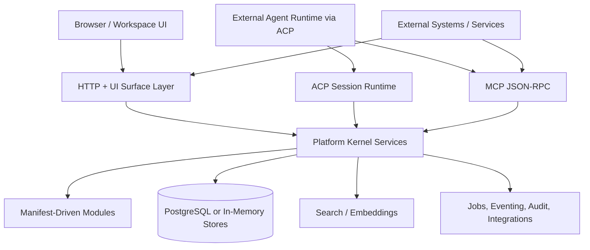

# Orbyte Platform

Orbyte is an agentic-ready modular business application platform for operational systems, backoffice workflows, analytics, machine-facing APIs, and agent-driven execution.

It combines a metadata-driven kernel, profile-driven business modules, generic UI surfaces, ACP-backed agent sessions, and machine-facing HTTP/MCP contracts in a single runtime.

The agentic-ready claim is grounded in two built-in integration layers:

- ACP for governed agent session connectivity and provider-backed runtime access
- MCP for structured tools, resources, skills, and workflows that improve agent tool orchestration

The platform is built around:

- modular business capabilities assembled through kernel packs and manifests
- generic UI, HTTP, and admin surfaces running on the same runtime
- MCP-exposed tools, resources, skills, and workflows for agent orchestration
- ACP-backed agent connectivity with governed access into platform capabilities

This repository contains:

- the Go application server
- the module and kernel-pack manifests
- the React workspace frontend
- MCP and ACP integration
- contract generation and validation tooling
- local demo/seed flows for POS, dashboards, CRM, and agent scenarios

## Architecture At A Glance



## Getting Started

```bash
make test
make run
```

For PostgreSQL-backed development:

```bash
docker compose up -d postgres
make migrate-up
make run-postgres
```

Common commands:

```bash
make test
make contracts
make frontend-verify
make docs-build
make seed-crm-demo
make validate-crm-agent
```

Default local values:

- app URL: `http://127.0.0.1:18110`
- bootstrap admin password: `admin123!`
- JWT secret: `dev-secret`

See [docs/getting-started.md](docs/getting-started.md) for prerequisites, install steps, runtime modes, seed flows, and validation commands.

## Installation

Prerequisites:

- Go `1.25`
- Node.js and npm
- Docker and Docker Compose
- `psql` for local reset helpers

Main entry points:

- `go run ./cmd/server`
- `go run ./cmd/migrate`
- `go run ./cmd/contractsgen`
- `go run ./cmd/agentproof ...`

See [docs/getting-started.md](docs/getting-started.md) for the full setup flow.

## Configuration

The main built-in config areas are:

- `platform.http`
- `platform.acp`
- `platform.mcp`
- `platform.db`
- `search.typesense`
- `search.embedding`
- `eventing.nats`
- `identity.auth`

Important environment variables:

- `APP_ADDRESS`
- `APP_ENV`
- `APP_JWT_SECRET`
- `APP_BOOTSTRAP_ADMIN_PASSWORD`
- `APP_AUTH_DEV_MODE`
- `APP_DOMAIN_PROFILE`
- `DATABASE_URL`

The most important current MCP runtime settings are under `platform.mcp`:

- `enabled`
- `exposure_mode`
  - `full`
  - `compact`
  - `minimal`
- `discovery_mode`
  - `keyword`
  - `vector`
  - `hybrid`
- `tool_discovery_mode`
- `playbook_discovery_mode`
- `discovery_indexing_enabled`
- `governance_enabled`
- `default_action_mode`
- `playbooks_json`

See [docs/configuration.md](docs/configuration.md) for the full runtime and environment model.

## Current Platform Shape

Core platform areas:

- identity, roles, sessions, service principals, delegated execution
- configuration definitions and scoped runtime entries
- generic models, documents, and workflows
- analytics, dashboards, datasets, and reporting
- search and indexing
- audit, jobs, eventing, integrations, idempotency
- ACP session runtime and MCP server

Current business modules:

The repo currently includes kernel packs for:

- commercial and promotions
- CRM
- procurement, inventory, fulfillment, delivery, returns, supplier returns
- planning, production, production costing, traceability, recall
- POS
- finance reporting, manual journals, collections, treasury, fixed assets, retail finance, inventory finance
- workforce, attendance, leave, payroll, payroll remittance, employee spend
- masterdata, reference masterdata, organization structure
- analytics, documents, workflow approval policy, monitoring, integration

There is also a profile-driven example business module under `internal/modules/clinic.go`.

See [docs/modules.md](docs/modules.md) for the current module inventory and capabilities.

## Surfaces

Current surfaces:

- `backoffice`
- `admin`
- `worklist`
- `self_service`
- `agent`
- `pos`
- `dashboard`
- `mobile`

Key routes:

- `/ui`
- `/admin`
- `/mcp`
- `/mcp/analytics`
- `/agent/api/...`
- `/auth/...`
- `/healthz`
- `/readyz`

See [docs/surfaces.md](docs/surfaces.md) for the current surface model.

## Agent Runtime

Current agent-facing runtime capabilities:

- ACP provider-backed agent sessions
- MCP JSON-RPC endpoints
- MCP skills and workflow/playbook discovery for better tool orchestration
- switchable MCP exposure modes
- minimal MCP discovery with:
  - `skills.find`
  - `skills.describe`
  - `tools.find`
  - `tools.describe`
  - `tools.call`
- dashboard artifact promotion into ACP sessions
- service-principal and delegated-user agent access

In practice, ACP gives Orbyte a controlled way to connect agents to the platform runtime, while MCP exposes the business capabilities, skills, and workflows agents can discover and orchestrate.

See [docs/agent-integration.md](docs/agent-integration.md) for the current agent runtime and integration model.

## Module Development

Modules are defined through manifests and kernel packs, not ad hoc route-only extensions. Current development hooks include:

- manifest registration
- permissions and role templates
- models, documents, datasets, workflows
- UI menus, actions, views, and dashboard widgets
- MCP tools and resources
- profile-based bootstrapping

See [docs/module-development.md](docs/module-development.md) for current development guidance.

## Documentation

The repository documentation is authored in `docs/` and built into a static site with MkDocs Material.

Primary docs entry pages:

- [Documentation Home](docs/index.md)
- [Getting Started](docs/getting-started.md)
- [Configuration](docs/configuration.md)
- [Architecture](docs/architecture.md)
- [Features](docs/features.md)
- [Modules](docs/modules.md)
- [Surfaces](docs/surfaces.md)
- [Agent Integration](docs/agent-integration.md)
- [Module Development](docs/module-development.md)

Build the rendered docs site with:

```bash
make docs-build
```

Current docs behavior:

- `docs/` is the maintained source
- `site/` is generated output
- generated pages are built as `site/*.html` so they can be opened directly from disk
- Mermaid diagrams are supported in the generated site with a vendored local script

## Contracts

Published contract artifacts are generated into:

- `contracts/openapi/<version>/openapi.json`
- `contracts/mcp/<version>/catalog.json`

Generate them with `make contracts`.

## Notes

- Startup requires `APP_JWT_SECRET`.
- In non-PostgreSQL local development, `APP_AUTH_DEV_MODE=true` allows a seeded ephemeral dev auth path.
- The default docs site is built with MkDocs Material from `docs/` into `site/`.
