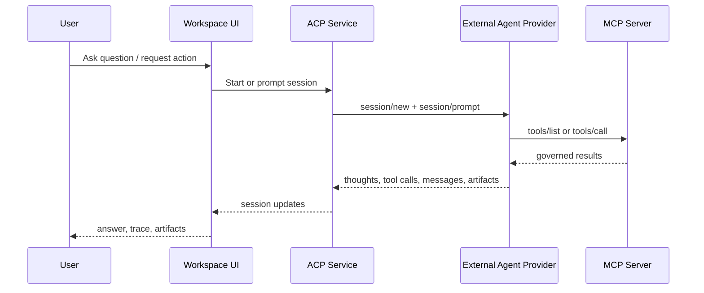

# Agent Integration

<p class="page-intro">
This guide describes the current agent integration model: ACP sessions, MCP endpoints, exposure modes, minimal-mode discovery, and the way the workspace UI consumes agent/runtime state.
</p>

## Start Here

<div class="quick-links" markdown>

- [**ACP vs MCP**](#current-integration-model)
  Understand the current separation between session runtime and business tooling.
- [**Exposure Modes**](#mcp-exposure-modes)
  Compare full, compact, and minimal MCP.
- [**Minimal Mode**](#current-minimal-mcp-surface)
  Review the 5-tool discovery-and-execution surface.
- [**Skills**](#skills)
  See what a current skill can encode and how it guides execution.

</div>

## Current Integration Model

Orbyte separates:

- ACP
  - provider/session runtime for external agent engines
- MCP
  - governed machine-facing business interface

This separation is visible in code:

- ACP service: `internal/platform/acp/`
- MCP server: `internal/platform/mcp/`
- agent UI: `frontend/src/features/agent/AgentSurfacePage.tsx`
- HTTP wiring: `internal/platform/httpx/mcp.go`

## Current Endpoints

### MCP

- `POST /mcp`
- `POST /mcp/analytics`

### ACP / agent workspace

- `/agent/api/sessions`
- `/agent/api/sessions/{id}`
- `/agent/api/sessions/{id}/prompt`
- workspace UI under `/ui` with the agent surface available from the workspace shell

## ACP

ACP is used for:

- starting sessions against external providers
- prompting active sessions
- tracking messages, trace events, plans, approvals, and artifacts
- selecting models when the provider supports it

Current ACP provider config is deployment-scoped under `platform.acp`.

## MCP Exposure Modes

Current MCP runtime config lives under `platform.mcp`.

Current exposure modes:

- `full`
  - direct business tool inventory
- `compact`
  - shaped direct catalog
- `minimal`
  - minimal discovery/control surface only

## Current Minimal MCP Surface

Current primary minimal tools:

| Tool | Purpose |
| --- | --- |
| `skills.find` | first-step workflow discovery |
| `skills.describe` | load one or more detailed workflow contracts |
| `tools.find` | fallback tool discovery when no skill matches |
| `tools.describe` | load detailed tool schemas and governance metadata |
| `tools.call` | execute one discoverable tool by id |

The minimal contract is intentionally workflow-first:

1. find a matching skill
2. describe the skill
3. if no skill fits, find tools
4. describe tools
5. call the selected tool

<div class="orbyte-note">
The current minimal MCP surface is intentionally small. It is designed to reduce context size and encourage workflow-first tool use.
</div>

## Skills

Current skills are configured through `platform.mcp.playbooks_json` and exposed through `skills.*`.

Current skill structure supports:

- `id`
- `name`
- `description`
- `domains`
- `labels`
- `keywords`
- `use_when`
- `workflow_steps`
- `tool_inventory`
- `required_final_facts`
- `required_artifacts`
- `required_draft_outputs`
- `guardrails`
- `success_checks`
- `pitfalls`

This means skills can currently act as:

- investigation workflows
- execution workflows
- intake/triage workflows

## Current MCP Discovery Behavior

Current discovery behavior is configurable through:

- `discovery_mode`
- `tool_discovery_mode`
- `playbook_discovery_mode`
- `discovery_indexing_enabled`

Supported discovery modes:

- `keyword`
- `vector`
- `hybrid`

Current behavior note:

- vector-style discovery only remains vector when a semantic embedder is configured
- otherwise MCP discovery degrades to keyword behavior explicitly

## Governance

Current governance controls include:

- permission-based tool visibility
- blocked action classes
- blocked tool keys
- blocked document types
- allowed submit document types
- default action mode
- domain policy overrides

`tools.call` executes through the normal governed path rather than bypassing direct runtime checks.

## Agent Workspace Behavior

The current workspace agent surface:

- consumes ACP session state
- renders messages, tool traces, plans, and artifacts
- uses surface/bootstrap metadata from the workspace shell
- supports artifact rendering for dashboard previews

The current minimal-mode prompt guidance is designed to push the model toward skill-first discovery, but provider behavior still matters in practice.

## Current Known Strengths

- switchable full/compact/minimal MCP exposure
- minimal MCP is materially smaller than full tool exposure
- skills can encode explicit workflow, facts, artifacts, and guardrails
- CRM and retail scenarios already use this structure in validation

## Current Known Constraints

- some ACP/OpenCode sessions still stall mid-turn
- successful skill selection does not always guarantee completed tool execution
- output-contract compliance can still lag behind correct tool selection

## Current Validation Tooling

The repository includes `cmd/agentproof`, which currently supports:

- runtime configuration seeding
- business scenario seeding
- MCP validation
- CRM-focused validation
- seeded POS, dashboard, CRM, and retail flows

Relevant `Makefile` helpers:

```bash
make seed-agent-runtime
make validate-mcp
make validate-crm-agent
```

## Current Example Agent Use Cases

The codebase currently contains and validates skills for flows such as:

- CRM service backlog triage
- CRM customer 360 review
- CRM sales pipeline review
- CRM service-to-sales lead capture
- CRM complaint ticket intake
- retail recovery investigation and execution support

## Diagram



## Related Guides

- [Configuration](./configuration.md)
- [Architecture](./architecture.md)
- [Modules](./modules.md)
- [Surfaces](./surfaces.md)

## Recommended Next Pages

<div class="next-steps" markdown>

- [Configuration](./configuration.md) for `platform.mcp` and `platform.acp` details
- [Surfaces](./surfaces.md) for how agent UI and MCP fit into the wider delivery model

</div>
