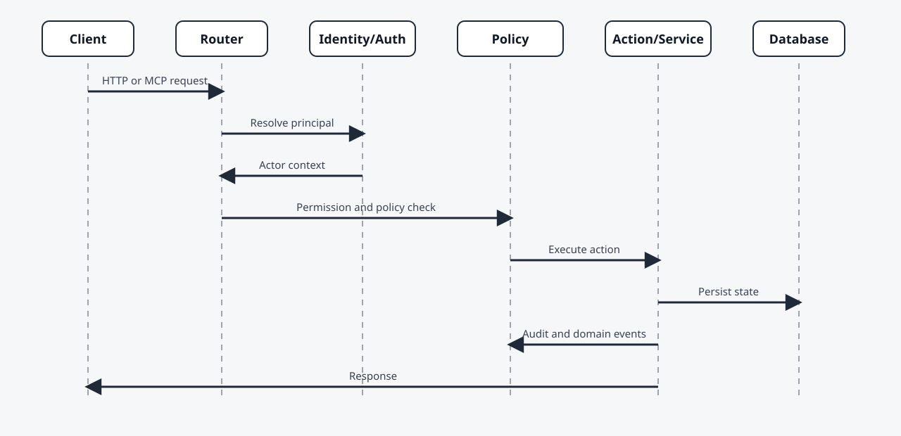

# Architecture

This guide describes the runtime architecture of Orbyte.

## High-Level View

At a high level, Orbyte is a modular Go application with:

- a bootstrapped kernel
- a bootstrap/container composition layer
- manifest-driven business modules
- generic HTTP and MCP runtime surfaces
- optional external infrastructure such as PostgreSQL, Typesense, NATS, SMTP, and object storage

For the target-state engineering role of MCP and its relationship to ACP and the agent workspace, see [MCP Target Architecture](./mcp-target-architecture.md).

## Reference Diagram


```text
                    +-----------------------------+
                    |  External Users and Systems |
                    +-------------+---------------+
                                  |
              +-------------------+-------------------+
              |                                       |
       +------+-------+                       +-------+------+
       | Browser Apps |                       | AI / Services |
       +------+-------+                       +-------+------+
              |                                       |
              +-------------------+-------------------+
                                  |
                          +-------+--------+
                          |  Orbyte Server  |
                          |-----------------|
                          | HTTP APIs       |
                          | UI contracts    |
                          | Admin APIs      |
                          | MCP endpoints   |
                          +-------+--------+
                                  |
          +-----------------------+-----------------------+
          |                       |                       |
   +------+-------+       +-------+------+       +--------+------+
   | Kernel Svcs  |       | Business Mods |       | Async Runtime |
   |--------------|       |---------------|       |---------------|
   | identity     |       | models        |       | jobs          |
   | config       |       | documents     |       | outbox        |
   | policy       |       | workflows     |       | retries       |
   | integration  |       | views         |       | projections   |
   | search       |       | tools         |       | deliveries    |
   +------+-------+       +-------+------+       +--------+------+
          |                       |                       |
          +-----------------------+-----------------------+
                                  |
        +------------+------------+------------+------------+
        |            |                         |            |
 +------+-----+ +----+------+           +------+----+ +-----+------+
 | PostgreSQL | | Typesense |           |   NATS    | | SMTP/Object |
 +------------+ +-----------+           +-----------+ +------------+
```

Diagram source files for future rendering:

- `docs/assets/architecture-overview.mmd`
- `docs/assets/request-flow.mmd`

## Runtime Layers

### 1. Storage Layer

The storage layer persists platform state.

Primary storage options:

- PostgreSQL
- in-memory repositories for local development and tests

The schema includes:

- organizations and locations
- users, roles, sessions, service principals
- configuration entries
- model definitions and records
- document definitions and records
- installed modules
- workflow state
- audit and eventing data

### 2. Platform Services

The kernel is composed from a set of services, including:

- configuration
- feature flags
- organization and identity
- module registry
- model and document services
- workflow engine
- audit and eventing
- search
- analytics and reporting
- policy
- integration
- idempotency
- jobs
- template output
- runtime health and monitoring

These services are assembled during app startup and validated before the server begins accepting requests.

### Bootstrap Boundary

The current runtime is intentionally split into two responsibilities:

- bootstrap/container assembly creates repositories, services, runtime adapters, MCP server wiring, and application dependencies
- `httpx` remains transport-focused and consumes already-built dependencies to register HTTP routes and middleware

This separation keeps delivery concerns out of service construction and makes runtime assembly easier to test and reason about.

### 3. Runtime Actions

On top of the services, Orbyte defines higher-order application actions such as:

- document actions
- model actions
- kernel command execution through unit-of-work patterns

These actions handle:

- optimistic concurrency
- transactional writes
- audit recording
- domain event emission
- outbox creation

### 4. Delivery Surfaces

Orbyte exposes multiple surfaces:

- HTTP APIs
- UI contract endpoints for generic shells
- admin APIs
- MCP JSON-RPC endpoints
- analytics event streams

These surfaces are intended for:

- browser-based operators
- external applications
- automation clients
- service principals
- external AI agents

MCP should be treated as the canonical machine-facing business contract for external agents, while ACP remains the runtime/session bridge to external providers. The detailed target-state model is defined in [MCP Target Architecture](./mcp-target-architecture.md).

## Extension Model

The platform is extended by module manifests. There are two main sources of manifests at startup:

- built-in kernel packs, which provide the platform's core capability base
- profile-provided business manifests, which add domain-specific modules selected by `APP_DOMAIN_PROFILE`

A module can contribute:

- models
- documents
- workflows
- config definitions
- permissions and role templates
- policy hooks
- search indexes
- datasets and reports
- templates
- UI views and actions
- offline capabilities
- MCP tools and resources

This allows the kernel to stay stable while business capabilities evolve independently.

The target direction is for modules to be broadly discoverable and operable through MCP in business terms, using a mix of generic platform tools, synthetic module wrappers, and specialized hand-authored tools. See [MCP Target Architecture](./mcp-target-architecture.md).

## Runtime Configuration and Identity Helpers

Process-level runtime settings are centralized through typed runtime configuration instead of being read ad hoc throughout the codebase. Runtime-generated identifiers are also standardized through a shared ID service.

This gives the platform:

- consistent startup behavior
- cleaner operational configuration boundaries
- deterministic contract generation
- more uniform IDs across jobs, submissions, sessions, and runtime-created records

## Request Flow

A typical runtime request follows this path:

1. authentication and principal resolution
2. authorization and policy checks
3. service or action execution
4. persistence
5. audit and event recording
6. asynchronous follow-up through jobs, outbox, or integration processing



### Example Synchronous Flow

```text
client -> auth -> permission check -> policy check -> document/model action
       -> transaction -> audit/event/outbox -> response
```

### Example Asynchronous Flow

```text
business write -> domain event -> outbox/job -> integration adapter
               -> retry/dead letter if needed -> downstream system
```

## Event and Integration Flow

Business writes can generate:

- audit events
- domain events
- outbox records
- search projection updates
- analytics snapshots
- integration submissions

This allows Orbyte to support both synchronous APIs and asynchronous enterprise integration patterns.

## Configuration and Policy Flow

Configuration is resolved using scope inheritance:

- deployment
- organization
- location

Policies can be defined through:

- built-in evaluators
- Rego modules
- scoped configuration-backed rules

This allows governance to change without patching business code.

## AI and Agent Connectivity

Orbyte is intentionally designed so AI interaction happens through governed surfaces, not hidden internal shortcuts.

The preferred connection patterns are:

- HTTP APIs for application integration
- MCP tools and resources for agent tooling
- events and integration contracts for asynchronous workflows
- service principal and delegation models for controlled non-human access

### Recommended Responsibility Split

```text
External AI runtime:
- planning
- reasoning
- user interaction
- multi-step orchestration

Orbyte:
- source of truth
- approved actions
- policy and permission enforcement
- audit trail
- integration state
```

## Deployment Topology

Typical topology:

- Orbyte application server
- PostgreSQL
- optional Typesense
- optional NATS
- optional SMTP and object storage
- external clients, business apps, and AI agents connected through API and MCP surfaces

## Architecture Outcomes

This architecture is optimized for:

- modularity
- governance
- operational traceability
- machine integration
- long-lived enterprise evolution
