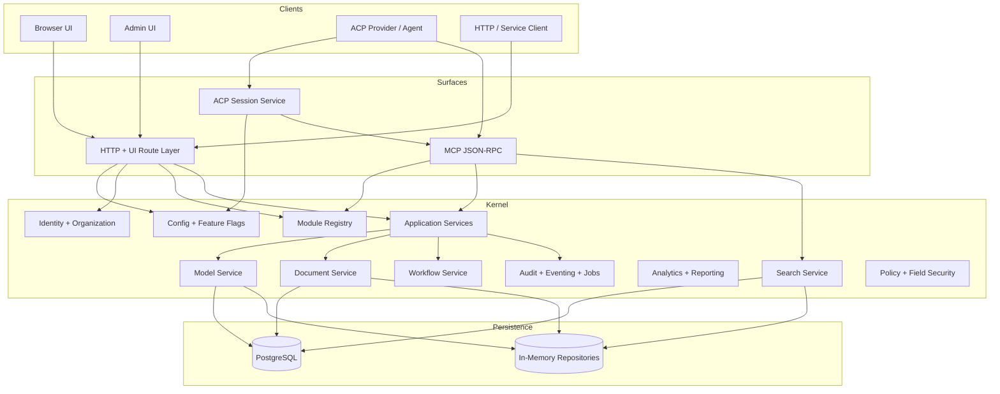

# Architecture

This guide describes the current runtime architecture in the codebase, including the service graph, module composition, storage modes, and machine-facing surfaces.

## In One Sentence

Orbyte is a modular Go runtime that composes platform services, manifest-driven business capability, and multiple delivery surfaces over either in-memory or PostgreSQL-backed repositories.

## High-Level Shape

Orbyte is a modular Go application composed from:

- a core service graph
- kernel-pack manifests
- optional profile-provided business manifests
- HTTP, UI, MCP, and ACP runtime surfaces
- in-memory or PostgreSQL-backed repositories

## Current Runtime Diagram

## Read This Page By Question

- [**How does startup work?**](#boot-process)
  See the bootstrap sequence and runtime assembly order.
- [**What are the main layers?**](#core-runtime-layers)
  Review the kernel, application services, and manifest contributions.
- [**Where does state live?**](#storage-model)
  Compare in-memory and PostgreSQL-backed modes.
- [**How do agents fit in?**](#mcp-and-acp-positioning)
  Understand the current MCP and ACP split.

## Boot Process

The current bootstrap path lives mainly in `internal/platform/app/construction.go`.

At startup the app:

1. creates the core service graph
2. registers built-in config definitions and built-in entries
3. initializes identity, config, modules, models, documents, workflows, audit, search, analytics, MCP, and ACP
4. installs PostgreSQL-backed repositories if `DATABASE_URL` is set
5. loads kernel packs and profile-selected business manifests
6. seeds platform kernel metadata, permissions, references, views, workflows, and related runtime contracts
7. registers HTTP, UI, MCP, and admin routes

The current bootstrap boundary is deliberate: service construction lives in <code>internal/platform/app/</code>, while HTTP transport and surface wiring live in <code>internal/platform/httpx/</code>.

## Core Runtime Layers

### 1. Platform kernel services

The current service graph includes:

- config
- feature flags
- organization
- identity
- module registry
- model service
- document service
- workflow service
- audit service
- reporting and analytics
- search
- policy and field security
- integration and eventing
- jobs
- template output
- idempotency
- ACP service
- MCP server

### 2. Application services

The current codebase also assembles higher-level application services for business areas such as:

- CRM
- commercial
- procurement
- inventory
- fulfillment
- delivery
- returns
- planning
- production
- POS
- finance
- workforce and payroll

These are the services that MCP tools and custom UI routes often call directly.

### 3. Module manifests

Business behavior is not defined only by route handlers. Much of the platform shape comes from manifests that contribute:

- permissions
- roles
- models
- documents
- workflows
- views
- actions
- datasets
- widgets
- self-service APIs
- MCP-related metadata

Current manifest sources:

- kernel packs under `internal/platform/app/kernelpacks_*.go`
- profile modules under `internal/modules/`

## Storage Model

The platform currently supports two persistence modes.

### In-memory repositories

Used for:

- fast local development
- many tests
- quick feature work without PostgreSQL

### PostgreSQL repositories

Used for:

- realistic local development
- seeded demos
- MCP/agent validation
- production-style persistence

The service graph swaps repository implementations depending on whether `DATABASE_URL` is present.

## Search And Discovery

The current search stack supports:

- repository-backed search service
- source attachment from documents and models
- field-security-aware search behavior
- Typesense integration configuration
- embedding configuration
- MCP discovery modes for keyword, vector, and hybrid retrieval

## MCP And ACP Positioning

The current architecture separates:

- ACP
  - session/runtime bridge to external agent providers
- MCP
  - governed business-facing JSON-RPC interface

Current HTTP registration exposes:

- `POST /mcp`
- `POST /mcp/analytics`
- optional analytics event streams

ACP is configured through `platform.acp`, while MCP is configured through `platform.mcp`.

## UI And Surface Model

The workspace shell is surface-aware and bootstrap-driven.

Current declared surfaces in code:

- `user`
- `admin`
- `both`
- `backoffice`
- `worklist`
- `self_service`
- `agent`
- `pos`
- `dashboard`
- `mobile`

Surface-specific menus, actions, views, custom entries, flows, and dashboard widgets are resolved through the module service and UI bootstrap resolver.

## Request Lifecycle

Typical synchronous flow:

1. route and auth resolution
2. principal construction
3. permission/policy checks
4. application service or action execution
5. repository writes
6. audit and event capture
7. response serialization

Typical asynchronous follow-up:

1. business write completes
2. audit/domain events or outbox entries are recorded
3. jobs/integration/eventing continue downstream work

## Module Composition Model

The current repo uses two composition layers:

- built-in kernel packs
  - always available foundation modules
- profile-specific business manifests
  - selected through `APP_DOMAIN_PROFILE`

Known profiles today:

- `all`
- `clinic`
- `oms`

`clinic` is the only non-empty example profile in `internal/modules` today.

## Current Design Characteristics

What the architecture optimizes for today:

- manifest-driven expansion
- governed machine access
- metadata-driven UI and business contracts
- profile-aware startup
- runtime-configurable MCP/ACP behavior

What it does not do:

- embed a hard-wired autonomous agent into the kernel
- depend on a single persistence backend
- model every business workflow as a custom hand-written UI flow

## Recommended Next Pages

- [Modules](./modules.md) for the current capability inventory
- [Surfaces](./surfaces.md) for UI, MCP, ACP, and dashboard-facing delivery paths
- [Agent Integration](./agent-integration.md) for the runtime machine-access model

## Related Guides

- [Features](./features.md)
- [Modules](./modules.md)
- [Agent Integration](./agent-integration.md)
- [Surfaces](./surfaces.md)
- [Configuration](./configuration.md)
