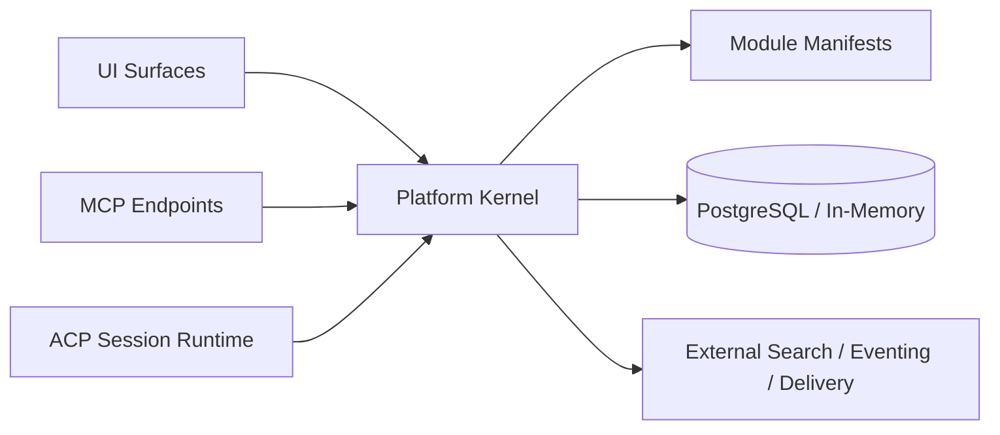

# Orbyte Documentation

Orbyte is a modular business application runtime with a metadata-driven kernel, profile-driven modules, generic UI surfaces, MCP/ACP agent connectivity, and a mix of in-memory and PostgreSQL-backed operating modes.

This documentation set is aligned to the current codebase in:

- `cmd/`
- `internal/platform/`
- `internal/modules/`
- `frontend/`

## What This Repository Currently Implements

- a Go server runtime with typed platform services
- manifest-driven kernel packs for core and business capabilities
- a React workspace frontend under `frontend/`
- MCP JSON-RPC endpoints and ACP-backed agent sessions
- scoped runtime configuration and admin configuration APIs
- contract generation for OpenAPI and MCP catalogs
- demo and validation tooling through `cmd/agentproof`

## Start Here

- [**Getting Started**](./getting-started.md)
  Install the project, choose a runtime mode, and verify the server is healthy.
- [**Architecture**](./architecture.md)
  Understand the current service graph, module composition, and runtime surfaces.
- [**Configuration**](./configuration.md)
  Learn the built-in config keys, scopes, and MCP/ACP runtime settings.
- [**Agent Integration**](./agent-integration.md)
  See how ACP sessions, MCP exposure modes, and minimal skill discovery work today.

## Documentation Map

<h3>Runtime And Product Surface</h3>

- [Features](./features.md)
- [Modules](./modules.md)
- [Surfaces](./surfaces.md)
- [Agent Integration](./agent-integration.md)

<h3>Build On Orbyte</h3>

- [Module Development](./module-development.md)
- [Module System](./module-system.md)
- [Module Generator](./modulegen.md)
- [First Module Tutorial](./tutorial-first-module.md)

<h3>Operate And Integrate</h3>

- [Integration](./integration.md)
- [Deployment](./deployment.md)
- [Operations](./operations.md)
- [API and Contracts](./api-and-contracts.md)
- [Security and Governance](./security-and-governance.md)

## Current Runtime Topology

## Current Priorities Reflected In Code

- profile-driven module composition
- generic UI route/bootstrap contracts
- governed MCP exposure modes
- minimal MCP discovery with skills and tool discovery
- business demo and validation harnesses for retail, inventory, dashboard, POS, and CRM scenarios

## Recommended Reading Order

1. [Getting Started](./getting-started.md)
2. [Architecture](./architecture.md)
3. [Configuration](./configuration.md)
4. [Features](./features.md)
5. [Modules](./modules.md)
6. [Agent Integration](./agent-integration.md)
7. [Module Development](./module-development.md)

## After This Page

- [Run the platform locally](./getting-started.md)
- [See what modules exist today](./modules.md)
- [Understand the current UI and machine-facing surfaces](./surfaces.md)

