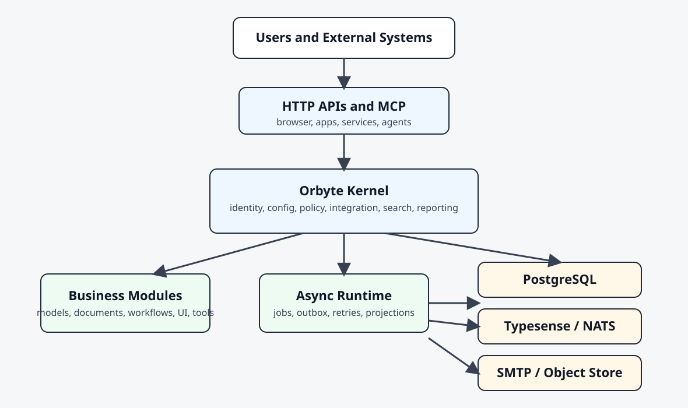

# Orbyte Platform

  <h1>Enterprise application kernel for data, workflow, integration, and AI connectivity.</h1>
  
Orbyte is a foundation platform for ERP, POS, MIS, and vertical operational systems. It gives product teams a governed runtime for business state, workflow, configuration, security, integration, and machine-facing tools without forcing a built-in agent architecture.

Orbyte is designed to be <strong>agent-ready</strong>, not <strong>agent-dependent</strong>. External AI systems should connect through HTTP, MCP, service principals, policy, and audit controls.

## Why Orbyte

- **Governed business runtime**

  Identity, permissions, policy hooks, workflow, and auditability are built into the platform layer.

- **Manifest-driven extensibility**

  Business capabilities are packaged as modules instead of hard-coded one-off applications.

- **Integration-first design**

  External systems, contracts, retries, dead letters, and machine-facing tools are first-class concerns.

- **Enterprise AI connectivity**

  External agents and copilots can consume data and approved actions through MCP and HTTP without bypassing governance.

## Start Here

- [Getting Started](./getting-started.md)
- [Concepts](./concepts.md)
- [Use Cases](./use-cases.md)
- [Architecture](./architecture.md)

## Core Product Areas

- [Features](./features.md)
- [Components](./components.md)
- [Configuration](./configuration.md)
- [Security and Governance](./security-and-governance.md)
- [Integration](./integration.md)
- [Product Packaging](./product-packaging.md)

## Build On The Platform

- [Module System](./module-system.md)
- [First Module Tutorial](./tutorial-first-module.md)
- [Reference Implementations](./reference-implementations.md)
- [API and Contracts](./api-and-contracts.md)
- [Sample Payloads](./sample-payloads.md)

## Operate The Platform

- [Deployment](./deployment.md)
- [Operations](./operations.md)
- [Walkthroughs](./walkthroughs.md)

## Shared Vocabulary

- [Glossary](./glossary.md)

## Diagram Preview

