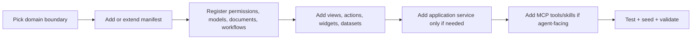

# Module Development

<p class="page-intro">
This guide focuses on how to extend the current codebase with new module capability in a way that matches the existing architecture.
</p>

## Start Here

<div class="quick-links" markdown>

- [**Pick The Right Extension Path**](#current-extension-model)
  Decide between a built-in kernel pack and a profile-driven module.
- [**Follow The Current Workflow**](#current-development-workflow)
  Add manifests first, then custom services only when necessary.
- [**Know The Code Paths**](#current-code-paths-to-know)
  Jump directly to the important directories.
- [**Validate Your Work**](#validation-commands)
  Use the current repo-native test and validation commands.

</div>

## Current Extension Model

There are two extension paths in the repo today:

1. extend built-in kernel packs under `internal/platform/app/`
2. add a profile-driven module under `internal/modules/`

Use kernel packs when the capability is part of the shared platform/business foundation.

Use `internal/modules/` when the capability is profile-scoped or when you want to model a standalone business module outside the built-in kernel inventory.

> Practical rule: if the feature is part of the platform’s broad default capability, add or extend a kernel pack first.

## What A Module Can Contribute

The current manifest model supports contributions such as:

- permissions and role templates
- config definitions
- reference data and reference types
- models
- documents
- workflows
- datasets
- search definitions
- frontend menus, actions, and views
- dashboard widgets
- self-service APIs
- custom entries
- MCP tool metadata and business capability metadata

## Current Development Workflow

### 1. Pick the right module boundary

Good current module boundaries are:

- one business domain
- clear ownership of models/documents
- a coherent permission surface
- explicit dependencies

Avoid:

- mixing unrelated business areas into one manifest
- adding route-only behavior with no manifest model when the capability is clearly modular

### 2. Choose the right location

- built-in kernel pack:
  - `internal/platform/app/kernelpacks_<domain>.go`
- profile module:
  - `internal/modules/<domain>.go` or generated package

### 3. Add manifest contributions

Typical contributions:

- model definitions
- document definitions
- workflow definitions
- role templates
- views/actions/menus
- datasets/widgets

### 4. Wire application services if needed

If your module needs richer business behavior than generic metadata-driven CRUD, add or extend an application service under:

- `internal/platform/application/`

Examples in the current codebase:

- `CRMCoreService`
- procurement/inventory/finance related services
- POS and planning-related services

### 5. Add MCP support deliberately

Current best practice in this repo is:

- do not expose raw write behavior without permissions and governance
- prefer explicit tool descriptions and business-domain metadata
- use minimal-mode skills when the workflow is non-trivial

### 6. Add tests

Current expected coverage usually includes:

- manifest validation
- service behavior tests
- MCP tests when tools are added
- route/bootstrap tests when surfaces are added

## Current Code Paths To Know

| Area | Current location |
| --- | --- |
| app bootstrap | `internal/platform/app/` |
| module service and models | `internal/platform/module/` |
| application services | `internal/platform/application/` |
| MCP runtime | `internal/platform/mcp/` |
| ACP runtime | `internal/platform/acp/` |
| HTTP/UI routing | `internal/platform/httpx/` |
| profile modules | `internal/modules/` |

## Current Profiles

Known profiles:

- `all`
- `clinic`
- `oms`

Current practical note:

- `clinic` is the only non-empty profile module example in `internal/modules`
- much of the production-like module surface is still delivered through built-in kernel packs

## Current Development Recommendations

### Prefer metadata first

If the platform can express the feature with:

- models
- documents
- workflows
- views
- permissions

then start there before adding bespoke handlers.

### Add custom behavior only where it pays off

The current codebase already does this in domains like:

- CRM summaries and customer 360
- planning and replenishment summaries
- dashboard previews
- POS demo flows

That is the right pattern: metadata for broad structure, custom services for high-value behavior.

### Be explicit about machine access

If your module will be used by agents:

- define business-domain metadata
- define permissions clearly
- decide whether generic business tools are enough
- add skill/workflow definitions if the use case is multi-step

## Example Module Development Sequence



## Validation Commands

Useful current commands:

```bash
make test
make frontend-verify
make contracts
make seed-crm-demo
make validate-mcp
```

For targeted Go packages:

```bash
go test ./internal/platform/app/...
go test ./internal/platform/mcp/...
go test ./internal/platform/httpx/...
```

## Current Examples Worth Following

- `internal/platform/app/kernelpacks_crm_core.go`
  - rich module with custom service behavior, widgets, and MCP tools
- `internal/platform/app/kernelpacks_leave_policy_core.go`
  - admin + self-service surface behavior
- `internal/modules/clinic.go`
  - profile-driven module example

## Related Guides

- [Modules](./modules.md)
- [Architecture](./architecture.md)
- [Agent Integration](./agent-integration.md)
- [Module System](./module-system.md)

## Recommended Next Pages

<div class="next-steps" markdown>

- [Modules](./modules.md) for the current inventory you are extending
- [Module System](./module-system.md) for the more conceptual manifest model

</div>
