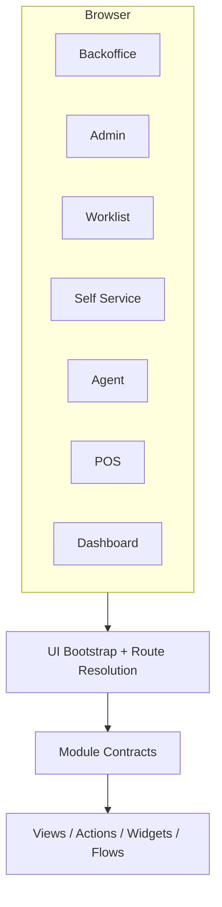

# Surfaces

This guide describes the current runtime surfaces exposed by the platform: UI surfaces, HTTP APIs, MCP, ACP-backed sessions, and analytics streams.

## Start Here

- [**Surface Types**](#current-surface-types)
  See the surfaces the platform currently declares in code.
- [**Workspace Bootstrap**](#workspace-bootstrap)
  Understand how the shell becomes surface-aware at runtime.
- [**HTTP Surfaces**](#http-surfaces)
  Review the main route families that operators, services, and agents use.
- [**MCP And ACP**](#mcp-as-a-surface)
  See where machine-facing interaction fits into the surface model.

## Current Surface Types

The current codebase declares these UI/runtime surfaces:

| Surface | Current role |
| --- | --- |
| `backoffice` | default operator workspace for business/admin-style navigation |
| `admin` | configuration, module, dashboard, and control-plane administration |
| `worklist` | focused task/work queue style navigation |
| `self_service` | end-user or employee self-service flows |
| `agent` | workspace-oriented agent interaction surface |
| `pos` | point-of-sale style interaction surface |
| `dashboard` | widget/dashboard-oriented surface |
| `mobile` | declared surface for mobile-targeted contract shaping |
| `user` / `both` | internal contract-shaping categories used by the module service |

## Surface Resolution

Surface routing is resolved in the HTTP/UI layer through:

- requested surface from the request
- visible contracts for the current principal
- fallback path resolution
- route-to-surface matching

Relevant code is currently in:

- `internal/platform/httpx/ui_surface_routes.go`
- `internal/platform/httpx/ui_route_resolution.go`
- `internal/platform/httpx/ui_bootstrap.go`
- `internal/platform/module/service.go`

## Workspace Bootstrap

The current workspace shell is bootstrap-driven.

The bootstrap payload contains:

- shell metadata
- surface
- menus
- actions
- views
- document flows
- self-service APIs
- default and fallback paths
- available surfaces
- auth context
- ACP/provider metadata

This allows the same shell to project different surface contracts without hard-coding every route.

## Current Surface Diagram

The current UI shell is contract-driven. Surface-specific menus, actions, flows, and widgets are resolved from the module service rather than hard-coded into one navigation tree.

## HTTP Surfaces

Important current HTTP surfaces include:

### Core runtime and auth

- `GET /healthz`
- `GET /readyz`
- `GET /platform/context`
- `GET /auth/options`
- `POST /auth/login`
- Google auth routes under `/auth/google...`

### UI shells and bootstrap

- `/ui`
- `/admin`
- UI bootstrap and route-resolution endpoints under the workspace/admin shells

### Agent/API surfaces

- `/agent/api/sessions`
- `/agent/api/sessions/{id}`
- `/agent/api/sessions/{id}/prompt`

### MCP

- `POST /mcp`
- `POST /mcp/analytics`

### Analytics streams

- analytics stream routes when enabled by runtime wiring

## MCP As A Surface

MCP is currently a first-class machine-facing surface, not just an add-on endpoint.

Current surface modes:

- `full`
- `compact`
- `minimal`

Minimal mode is currently intentionally narrow and discovery-oriented.

## ACP As A Surface

ACP is not a public business API like MCP. It is a session runtime surface used to:

- start sessions
- prompt sessions
- capture traces, plans, and artifacts
- bridge external agent providers into the workspace

## Dashboard Surface

The dashboard surface is currently used in two main ways:

- direct browser/operator dashboard interaction
- MCP/agent preview and artifact-oriented evidence generation

Current dashboard widgets and board previews can surface through both UI and agent workflows.

## Self-Service Surface

The clearest current self-service example in the codebase is leave self-service under `leave_policy_core`, where self-service APIs and views are explicitly registered for employee-facing use.

## POS Surface

`pos_core` currently contributes a POS-focused surface with cashier/manager behavior and seed/validation support for POS-oriented scenarios.

## Current Constraints

- not every module contributes to every surface
- `mobile` is declared as a surface but is less developed than backoffice/admin/agent/POS/dashboard
- surface behavior is mostly contract-driven, but some areas still rely on custom route handlers where business summaries or special flows are needed

## Related Guides

- [Architecture](./architecture.md)
- [Modules](./modules.md)
- [Agent Integration](./agent-integration.md)

## Recommended Next Pages

- [Architecture](./architecture.md) for the broader runtime assembly behind these surfaces
- [Agent Integration](./agent-integration.md) for ACP/MCP-specific delivery paths

